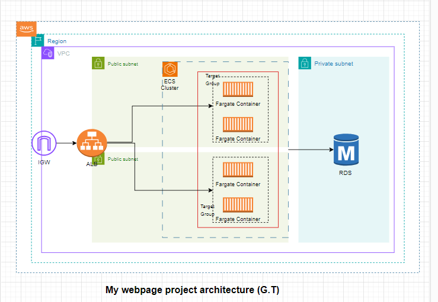

# my-webpage-infra
# Terraform Project for AWS Infrastructure

This Terraform project sets up an AWS infrastructure including an Application Load Balancer (ALB), ECS cluster with a Fargate task, and an RDS instance. This setup is designed for a web application that can be easily redeployed in different environments.

## Architecture Overview

The infrastructure consists of the following components:

- **Application Load Balancer (ALB)**: Distributes incoming web traffic to the ECS service.
- **ECS Cluster**: Hosts the Docker containers running your web application.
- **RDS Instance**: Provides a MySQL database for storing application data.

### AWS Architecture Diagram



## NOTE:

This architectural pattern for this web application can be deployed in several other cost effective ways such as using an s3 bucket, lambda and API gateway. However, the services used in this set-up were rather chosen so that it uses some common resources at GT infra such as ECS.

# Terraform Project for AWS Infrastructure

## Table of Contents

   * [Context](#context-overview)
   * [General Information](#general-information)
   * [Infrastructure](#infrastructure)
      * [Infrastructure Architecture](#infrastructure-architecture)
      * [Prerequisites](#prerequisites)
      * [Usage](#usage)
   * [Application Code](#application-code)
   * [Cleanup](#cleanup)
   * [Security](#security)
   * [License](#license)

## Context

This repository contains Terraform code to deploy a fullstack application on Amazon ECS using Fargate, RDS, and other AWS resources. It demonstrates how to use AWS services to build and manage a scalable and reliable application infrastructure.

## General Information

The project is divided into two parts:
- **Code**: The code for the running application
    - **Client**: HTML/CSS/JavaScript code for the frontend application
    - **Server**: Python (Flask) code for the backend application
- **Infrastructure**: Contains the Terraform code to deploy the necessary AWS resources for the solution

## Infrastructure

The infrastructure folder contains the Terraform code to deploy the AWS resources. The *modules* folder stores the Terraform modules used in this project. The Terraform state is stored locally in the machine where you execute the terraform commands, but you can set up a Terraform backend configuration like an AWS S3 Bucket to store the state remotely. The AWS resources created by the script are detailed below:

- AWS Networking resources following best practices for high availability
- 1 ECR Repository
- 1 ECS Cluster with Fargate
- 1 ECS Service
- 1 Task Definition
- 2 Application Load Balancers (Public facing)
- IAM Roles and policies for ECS Tasks
- Security Groups for ALBs and ECS tasks
- 1 RDS Instance (MySQL)
- SES for sending emails
- Systems Manager Parameter Store for configuration management

## Infrastructure Architecture

The following diagram represents the infrastructure architecture being deployed with this project:

<p align="center">
  
</p>

## Prerequisites

Before launching the solution, please follow these steps:

1. **Install Terraform**: Use Terraform v0.13 or above. You can visit [Terraform's official webpage](https://releases.hashicorp.com/terraform/) to download it.
2. **Configure AWS Credentials**: Configure the AWS credentials on your machine (`~/.aws/credentials`).
3. **Store Configuration in Parameter Store**: Ensure the following parameters are stored in AWS Systems Manager Parameter Store:
MAIL_USERNAME
MAIL_PASSWORD
MAIL_DEFAULT_SENDER
MAIL_RECIPIENT
DB_USER
DB_PASSWORD
DB_HOST
DB_NAME

## Usage

**Step 1**: Initialize the Terraform Project
Navigate to the terraform directory and initialize the Terraform project:

```bash
Copy code
cd my-webpage-infra/
terraform init 
```
**Step 2**: Configure Variables
Update the variables.tf file with the necessary values or create a terraform.tfvars file to set these values.

**Step 3**: Apply the Terraform Plan
Run the terraform plan command to see the changes that will be made. Ensure you replace placeholder values with actual ones:

```shell
terraform plan -var aws_profile="your-profile" -var aws_region="your-region" -var project_name="your-project" -var certificate_arn="your-certificate-arn"
```
Review the plan, then apply it to create the resources:

```shell
terraform apply -var aws_profile="your-profile" -var aws_region="your-region" -var project_name="your-project" -var certificate_arn="your-certificate-arn"
```
**Step 4**: Access the Application
Once Terraform finishes the deployment, you can find the ALB DNS name in the Terraform output. Open this DNS name in a browser to access the application.

## Application Code
**Client App**
The client folder contains the code to run the frontend. This code is written in HTML/CSS/JavaScript and uses port 80.

**Server App**
The server folder contains the code to run the backend. This code is written in Python using Flask and uses port 5000.

## Cleanup
To delete all the resources created by this project, run the following command:

```shell
terraform destroy -var aws_profile="your-profile" -var aws_region="your-region" -var project_name="your-project"
```
## Security
Ensure that your AWS credentials are secured and that you follow best practices for IAM roles and policies.

## License
This project is licensed under the MIT License. See the LICENSE file for details.
